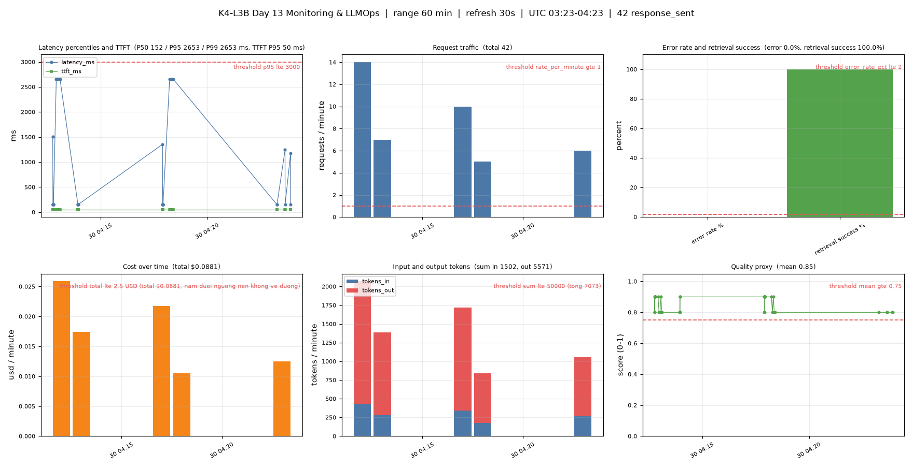
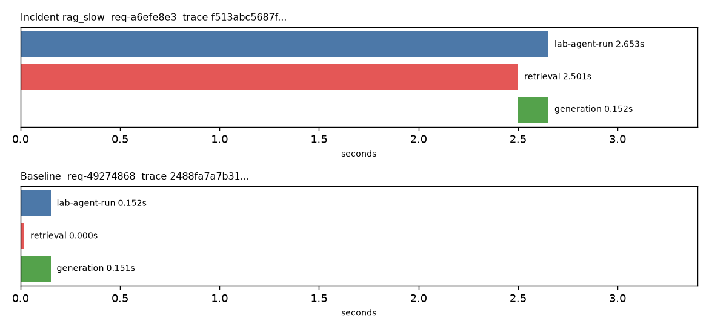

# Báo cáo cá nhân — K4-L3B Day 13 Monitoring & LLMOps

> Mỗi học viên hoàn thiện một file duy nhất này. Khi dẫn evidence, dùng đường dẫn tương đối, ví dụ `evidence/07-trace-waterfall.png`.

## 1. Thông tin học viên

- **Họ và tên:** Nguyễn Đức Đông
- **MSSV:** 2A202602367
- **Lớp:** K4-L3B
- **Repository URL:** https://github.com/nguyenducdong22/K4-L3-DAY13-NguyenDucDong-2A202602367-Monitoring-LLMOps
- **Commit SHA cuối:**
- **Challenge ID:** `day13-k4-l3b-monitoring-llmops-v1`
- **Tên project Langfuse cá nhân:** `day13-k4-l3b-2A202602367` (region EU, `cloud.langfuse.com`)

## 2. Evidence index

Điền đúng đường dẫn tới evidence thực tế. Có thể đổi tên hoặc dùng nhiều ảnh nếu cần.

| Evidence | Đường dẫn |
|---|---|
| Pytest cuối | `evidence/01-pytest.txt` |
| Log validator | `evidence/02-log-validator.txt` |
| Dashboard validator | `evidence/03-dashboard-validator.txt` |
| Structured log | `evidence/04-structured-log.txt` |
| PII redaction | `evidence/05-pii-redaction.txt` |
| Trace list | `evidence/06-trace-list.txt` |
| Trace waterfall | `evidence/07-trace-waterfall.png` |
| Trace metadata | `evidence/08-trace-metadata.txt` |
| Prompt versions | `evidence/09-prompt-versions.txt` |
| Prompt rollback | `evidence/10-prompt-rollback.txt` |
| Dashboard runtime | `evidence/11-dashboard-overview.png` |
| Incident metric | `evidence/12-incident-metric.txt` |
| Incident log | `evidence/13-incident-log.txt` |
| Incident trace | `evidence/14-incident-trace.txt` |

## 3. Kết quả kỹ thuật

| Nội dung | Baseline | Kết quả cuối | Nhận xét |
|---|---|---|---|
| `validate_logs.py` | chưa ghi lại (starter ~30/100 theo đề; tôi đã sửa code CP1 trước khi chạy validator) | 100/100 | 4/4 tiêu chí đạt |
| `validate_dashboard.py` | chưa ghi lại | 6/6 panel hợp lệ | chỉ kiểm tra contract; dashboard chạy thật ở `evidence/11-dashboard-overview.png` (`scripts/render_dashboard.py`) |
| `pytest` | chưa ghi lại | 24 passed | |
| Số traces hợp lệ | chưa ghi lại | 70 trace đủ cây và có usage/cost trong 60 phút cuối (`evidence/06-trace-list.txt`; 42 trace khớp `data/logs.jsonl` hiện tại) | đủ cây agent → retrieval + generation, có model/usage/cost/prompt version |
| Số PII leak | | 0 | test thật với email/SĐT/CCCD/thẻ giả: `evidence/05-pii-redaction.txt` |
| Latency P50 / P95 / P99 / TTFT P95 | | 152ms / 1301ms / 2255ms / 50ms | 18 request `response_sent`; P95/P99 bị kéo lên bởi request đầu sau khi khởi động (cold start, fetch prompt ~1–2.6s) |
| Retrieval success rate | | 100% | 0 `request_failed` |

## 4. Logging và PII

- **Cách tạo/nhận và truyền correlation ID:** `CorrelationIdMiddleware` xóa contextvars cũ, nhận `x-request-id` hoặc sinh `req-<8-hex>`, bind vào structlog, lưu `request.state.correlation_id`, trả lại qua header `x-request-id` và `x-response-time-ms`; ID cũng đưa vào metadata của trace.
- **Các metadata được ghi vào structured log:** `correlation_id`, `user_id_hash`, `session_id`, `feature`, `model`, `env`, `latency_ms`, `ttft_ms`, `tokens_in/out`, `cost_usd`, `quality_score`, `tool_name`, `tool_success`.
- **Cách bảo đảm PII được scrub trước khi ghi:** processor `scrub_event` đứng trước `JsonlFileProcessor` và `JSONRenderer` trong chuỗi structlog, quét đệ quy string/dict/list; `app/pii.py` có pattern email, điện thoại VN, CCCD, thẻ, passport.
- **Cách kiểm chứng kết quả:** xóa `data/logs.jsonl`, chạy `load_test.py`, rồi `validate_logs.py` (100/100, 0 PII leak) và `pytest` (24 passed).

## 5. Tracing và prompt versioning

- **Cách xác nhận traces do chính tôi tạo trong project cá nhân:** key pair sinh từ chính project của tôi (region EU, `https://cloud.langfuse.com`); đối chiếu `metadata.correlation_id` của 18 trace với `correlation_id` trong `data/logs.jsonl` (18/18 khớp).
- **Cấu trúc root/retrieval/generation observations:** `day13-agent-request` > `lab-agent-run` (agent) > `retrieval` (retriever) và `generation` (generation, có model, usage, cost).
- **Cách nối trace với log:** `correlation_id` (`req-<8-hex>`) có trong mọi dòng log và trong metadata của trace/observation `lab-agent-run`; tìm trace bằng cách lọc metadata `correlation_id`.
- **Prompt name:** `day13-chat` (text prompt, biến `{{feature}}`, `{{docs}}`, `{{message}}`).
- **Version/label baseline:** v1, labels `baseline` + `production`.
- **Version/label candidate:** v2, label `candidate` (thêm dòng "Please provide a concise and helpful response.").
- **Trace ID của mỗi version** (cùng input "How does monitoring help with incidents?"; fake LLM luôn trả cùng câu trả lời nên chỉ `prompt_version` và `tokens_in` khác nhau):

| Bước | Label | Version | correlation_id | Trace ID | tokens_in |
|---|---|---|---|---|---|
| Baseline | `baseline` | 1 | `req-77ba5591` | `1bea0e5c56295d0d0f399b0e3cde6c9e` | 39 |
| Candidate | `candidate` | 2 | `req-dc2ac690` | `832477a03f7a9d2afee69c6387513bb8` | 90 |
| Sau promote | `production` | 2 | `req-7738a489` | `535465fa857ff077414a09351641f195` | 90 |
| Sau rollback | `production` | 1 | `req-c4f29444` | `d797c887305a817ba21e5a17d1864f74` | 39 |

  10 trace của load test: `76a96f49fee9bd164f5fb4a1ce918751`, `d50349852e6ecf87519f886924282d5d`, `192a74204da375170837fd85ef098b6d`, `73a51873d5820cbdd92283fe6838d9e7`, `d316936ca4614f097bd73c7bea4eacb5`, `fae6955e910330412ccad91717b9162c`, `6c65bd40495c162a8df8ff9b98cec7a1`, `f7c921469d67b5c1ea1360b2141f8555`, `61c7161b3fa4ed92816a53a096304871`, `944f1a07277e86894d57b9e2aac2e476`.
- **Cách promote và rollback `production`:** không sửa code. Promote: gắn label `production` cho v2 (label tự rời v1), restart API, request kế tiếp có `prompt_version=2`. Rollback: gắn lại `production` cho v1, restart API, request kế tiếp có `prompt_version=1` và `tokens_in` trở về 39. Cần restart vì app cache prompt 60 giây.

## 6. Dashboard, SLO và alerts

- **Dashboard và sáu panel:** `config/dashboard.yaml` gồm latency (P50/P95/P99 + TTFT), traffic, errors (error rate + retrieval success), cost, tokens, quality.
- **SLO và lý do chọn:** 99.5% request có `response_sent` với latency <= 3000ms trong 28 ngày; baseline ~150ms nên còn nhiều headroom.
- **Cách tính error budget:** 100% - 99.5% = 0.5%; với 10,000 request thì tối đa 50 request lỗi/chậm.
- **Ba alert và runbook tương ứng:** `HighLatencyP95` (5m), `HighErrorRateOrRetrievalFailure` (3m), `CostOrQualityRegression` (10m); gửi Slack `#k4-l3b-alerts`, runbook trong `docs/alerts.md`.

> Ví dụ cách viết error budget: "SLO 99.5% trong 28 ngày nghĩa là error budget 0.5%. Nếu workload có 10,000 request thì tối đa 50 request được phép lỗi hoặc chậm hơn ngưỡng SLO."

## 7. Điều tra challenge

- **Challenge ID:** `day13-k4-l3b-monitoring-llmops-v1` (cohort K4, seed 1312, `affected_feature=monitoring`, ngưỡng 2000 ms)
- **Khoảng thời gian điều tra:** 2026-09-30 04:12:52Z (bật incident) đến 04:13:06Z (request cuối); tắt incident lúc 04:13:56Z.
- **Triệu chứng từ metrics:** `latency_ms` (từ `data/logs.jsonl`) tăng từ P50 151 ms / P95 153 ms (baseline, n=10) lên P50/P95 2652 ms (challenge, n=5), gấp ~17.5 lần và vượt ngưỡng 2000 ms. TTFT P95 giữ 50 ms; tokens_out trung bình 120 → 129, cost trung bình $0.0019 → $0.0020, 0 lỗi, `tool_success` 5/5. Vậy triệu chứng chỉ ở latency, không phải LLM/token/cost/lỗi. (Số latency phía client của `load_test.py` lớn hơn 8–13 s vì request xếp hàng khi `--concurrency 5`, nên không dùng.) Evidence: `evidence/12-incident-metric.txt`.
- **Log line và correlation ID liên quan:** `event=response_sent`, `correlation_id=req-a6efe8e3`, `feature=monitoring`, `latency_ms=2652`, `ttft_ms=50`, `tokens_out=153`, `tool_success=true`, lúc 2026-09-30T04:12:58.549Z. Cả 5 request challenge đều có `latency_ms` 2651–2653. Evidence: `evidence/13-incident-log.txt`.
- **Trace ID và span gây ảnh hưởng:** trace `f513abc5687f94e48870fad98ce1b338` (cùng `correlation_id=req-a6efe8e3`). `lab-agent-run` 2.653 s gồm span `retrieval` **2.501 s** và `generation` 0.152 s. Trace baseline `2488fa7a7b31ed1233d3b3f555c6d32a`: `retrieval` 0.000 s, `generation` 0.151 s. 5/5 trace challenge có cùng hình dạng (retrieval 2.50 s). Evidence: `evidence/14-incident-trace.txt`.
- **Root cause:** bước retrieval (RAG/vector store) bị chậm ~2.5 s mỗi request (incident `rag_slow`), không phải LLM generation, prompt hay token. Ba lớp cùng chỉ về một nguyên nhân: metric (latency tăng, TTFT/token/cost không đổi) → log (`latency_ms` ≈ 2652 ms) → trace (span `retrieval` = 2.5 s, `generation` vẫn 0.15 s).
- **Fix action:** tắt incident `rag_slow` (`python scripts/inject_incident.py --scenario rag_slow --disable`). Kiểm chứng: 5 request sau khi tắt có `latency_ms` 152, 156, 151, 152, 152 (về mức baseline).
- **Preventive measure:** alert `HighLatencyP95` (P95 > 3000 ms trong 5 phút) kèm runbook `docs/alerts.md#alert-1`; hạ ngưỡng theo `latency_threshold_ms=2000` của challenge cho feature `monitoring`; thêm timeout và fallback cho retrieval (ví dụ trả lời không có context khi retrieval > 1 s) và panel/alert riêng cho thời gian span `retrieval`, để lỗi ở retrieval được phát hiện trước khi người dùng thấy chậm.

> Gợi ý cách viết ngắn, không thay cho evidence thực tế: "Metric cho thấy `[latency/error/cost/quality]` bất thường trong `[khoảng thời gian]`. Log line `[event]` có `correlation_id=[...]` đại diện cho request bị ảnh hưởng. Trace cùng `correlation_id` cho thấy span `[retrieval/generation/prompt/tool]` có dấu hiệu `[chậm/lỗi/token tăng]`. Root cause là `[nguyên nhân suy ra từ evidence]`. Fix action là `[hành động khôi phục]`; preventive measure là `[alert/runbook/test/guardrail để ngăn tái diễn]`."

## 8. Giải thích và tự đánh giá

- **Một quyết định kỹ thuật quan trọng và lý do:** dùng `@observe` (như public test yêu cầu) để tạo span con `retrieval` và `generation`, và chỉ ghi metadata đã scrub (`query_preview`, `correlation_id`), không capture raw input/output vì câu hỏi có thể chứa PII. Prompt được truyền qua `prompt=` để Langfuse liên kết generation với đúng version thay vì hard-code metadata.
- **Một lỗi/blocker đã gặp:** (1) trace ban đầu thiếu model/usage/cost vì `update_current_generation` không nhận tham số `usage=` ở Langfuse SDK v4, lệnh gọi ném `TypeError` bị `except: pass` nuốt; (2) key Langfuse bị từ chối (401) khiến mỗi request phải chờ timeout, baseline nhiễu (400–2500 ms thay vì ~155 ms) và prompt rơi về `local-fallback`; (3) server `--reload` cũ giữ cổng 8000 và làm incident tự tắt.
- **Cách tìm nguyên nhân và xử lý:** đối chiếu dữ liệu thật trên Langfuse (API observations) với log thay vì tin vào việc code "chạy không lỗi"; đọc log server thấy `Error while fetching prompt ... 401`; kiểm tra tiến trình giữ cổng 8000. Sửa: bỏ `usage=` (dùng `usage_details`/`cost_details`), khôi phục key hợp lệ, tắt worker cũ, chạy uvicorn không `--reload`, rồi đo lại baseline sạch trước khi bật incident.
- **Cách hiểu luồng Metrics → Logs → Traces:** metrics cho biết *có* vấn đề và từ lúc nào (latency 151 → 2652 ms, các metric khác không đổi); log chọn ra một request cụ thể bằng `correlation_id` (`req-a6efe8e3`); trace cùng ID chỉ ra *bước nào* (retrieval 2.5 s, generation 0.15 s). Kết luận chỉ hợp lệ khi cả ba cùng chỉ về một nguyên nhân.
- **Vai trò của prompt version, token/cost, SLO hoặc rollback trong vận hành LLM:** mỗi trace ghi `prompt_version` nên khi có regression biết ngay request dùng prompt nào; đổi label không cần sửa code nên rollback nhanh (v2 → v1: `tokens_in` 90 → 39). Token/cost giúp phân biệt sự cố do LLM (tokens/cost tăng) với sự cố do retrieval (chỉ latency tăng). SLO + error budget cho biết mức lỗi/chậm chấp nhận được và khi nào cần alert.
- **Điều quan trọng nhất đã học:** không được tin vào "HTTP 200"; phải có telemetry đủ ba lớp và luôn kiểm tra baseline sạch trước khi kết luận một incident.
- **Hạn chế hoặc phần chưa hoàn thành, nếu có:** evidence 06–10 và 12–14 là output text/biểu đồ lấy từ Langfuse API và log, chưa phải ảnh chụp giao diện Langfuse; tên project Langfuse cần được đổi thành `day13-k4-l3b-2A202602367` (API báo tên hiện tại là `My Project`); prompt v2 có khối `Feature/Docs/Question` bị lặp hai lần do lúc tạo (không ảnh hưởng chức năng, giải thích `tokens_in` cao hơn); dashboard là ảnh tĩnh do script matplotlib dựng từ `data/logs.jsonl`, không tự refresh 30 giây; commit SHA cuối điền sau khi commit/push.

## 9. Checklist trước khi nộp

- [ ] Kết quả và evidence thuộc commit SHA cuối.
- [ ] Tất cả ảnh/output mở được bằng đường dẫn tương đối.
- [ ] Incident evidence nối đúng metric → log → trace.
- [ ] Trace/prompt evidence thuộc project Langfuse cá nhân và ảnh không lộ key/secret.
- [ ] Repository chạy lại được theo README.
- [ ] Không có secret, API key, PII thô hoặc evidence của người khác/lớp khác.
- [ ] URL repo và commit SHA cuối đã được nộp trên LMS/Codelabs.
